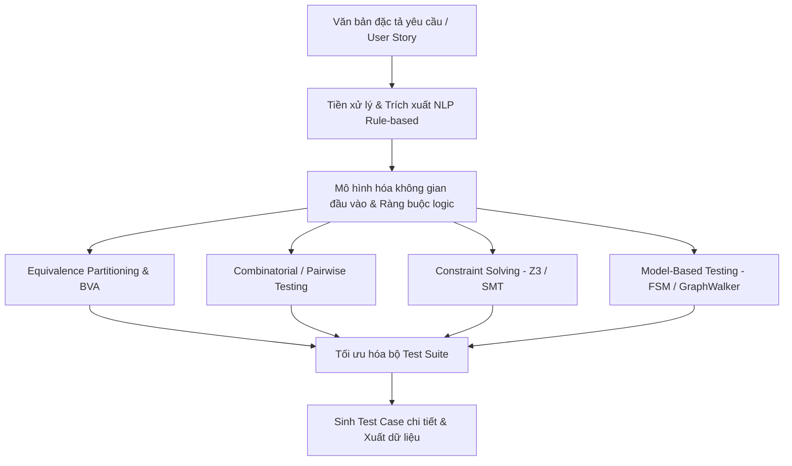

# BÁO CÁO KHẢO SÁT: HỆ THỐNG TỰ ĐỘNG SINH TEST CASE TỪ ĐẶC TẢ YÊU CẦU (SPECIFICATION-BASED AUTOMATED TEST CASE GENERATION)

> **Dự án**: Đồ án tốt nghiệp / CDIO-4  
> **Chủ đề**: Khảo sát và xây dựng hệ thống tự động sinh Test Case chức năng từ văn bản đặc tả yêu cầu (User Story / PRD) ứng dụng các kỹ thuật kiểm thử truyền thống và xử lý ngôn ngữ tự nhiên dựa trên luật.

---

## 1. TỔNG QUAN BÀI TOÁN & MỤC TIÊU

### 1.1. Đặt vấn đề
Trong quy trình phát triển phần mềm (SDLC), giai đoạn thiết kế test case thủ công từ tài liệu yêu cầu (PRD, SRS, User Stories) thường chiếm từ **30% - 40%** tổng thời gian kiểm thử. Việc này đối mặt với các thách thức:
- **Tốn nhân lực & thời gian**: Tester phải đọc hiểu, phân tích từng trường hợp biên, các tổ hợp dữ liệu phức tạp và điều kiện nghiệp vụ.
- **Dễ sót ca kiểm thử (Test Under-coverage)**: Các trường hợp ngoại lệ (negative test cases) hoặc tổ hợp dữ liệu phức tạp thường bị bỏ sót do lỗi chủ quan của con người.
- **Dư thừa ca kiểm thử (Test Redundancy)**: Viết nhiều test case trùng lặp phân vùng tương đương, làm lãng phí thời gian thực thi test.

### 1.2. Định nghĩa Đầu vào (Input) và Đầu ra (Output)
- **Đầu vào (Input)**:
  - Tài liệu đặc tả yêu cầu dạng văn bản (PRD / SRS).
  - Hoặc User Stories kèm Tiêu chí chấp nhận (Acceptance Criteria - AC) viết theo khuôn mẫu (VD: Gherkin `Given-When-Then`, EARS - Easy Approach to Requirements Syntax, hoặc cấu trúc bảng quyết định).
- **Đầu ra (Output)**:
  - Bộ Test Cases hoàn chỉnh gồm: `Test Case ID`, `Test Scenario`, `Pre-conditions`, `Test Steps`, `Test Data` (cụ thể), `Expected Result`, `Test Type` (Positive/Negative/Boundary), `Priority`.
  - Hỗ trợ xuất định dạng: Excel (.xlsx), CSV, Markdown, hoặc tích hợp Jira Xray / Zephyr / TestLink.

---

## 2. CÁC PHƯƠNG PHÁP & KỸ THUẬT KIỂM THỬ TRUYỀN THỐNG

Khác với tiếp cận dùng Mô hình ngôn ngữ lớn (LLM) vốn có tính bất định (nondeterministic) và dễ gặp ảo giác (hallucination), **tiếp cận truyền thống** tập trung vào **tính hình thức (formal methods), xác định (determinism), và đảm bảo độ phủ toán học (mathematical coverage criteria)**.



### 2.1. Kỹ thuật trích xuất ngữ pháp & phân tích cú pháp (Rule-based NLP)
Để máy tính hiểu được văn bản đặc tả mà không cần LLM, hệ thống sử dụng các kỹ thuật NLP truyền thống:
- **Pattern Matching (Biểu thức chính quy & Mẫu câu chuẩn)**:
  - Khuyến nghị sử dụng chuẩn **EARS (Easy Approach to Requirements Syntax)** hoặc **Gherkin**:
    - *Ubiquitous*: "Hệ thống PHẢI [hành động]..."
    - *Event-driven*: "KHI [sự kiện] THÌ hệ thống PHẢI..."
    - *State-driven*: "TRONG KHI [trạng thái] THÌ..."
    - *Optional-feature*: "NẾU CÓ [tính năng] THÌ..."
    - *Unwanted-behavior*: "NẾU [lỗi/ngoại lệ] THÌ hệ thống PHẢI..."
- **Dependency Parsing & POS Tagging (Stanford CoreNLP, spaCy, NLTK)**:
  - Phân tích cú pháp cây phụ thuộc để tìm:
    - Chủ ngữ (nsubj) $\rightarrow$ Actor (Người dùng/Hệ thống).
    - Động từ chính (ROOT) $\rightarrow$ Hành động (Action/Operation).
    - Tân ngữ (dobj/pobj) $\rightarrow$ Đối tượng/Trường dữ liệu (Field/Attribute).
    - Mệnh đề điều kiện (advcl với "nếu", "khi", "trong trường hợp") $\rightarrow$ Ràng buộc (Constraint / Precondition).
- **Trích xuất thông số & miền giá trị (Entity & Range Extraction)**:
  - Bóc tách kiểu dữ liệu: Số nguyên, chuỗi, ngày tháng, regex format (email, phone).
  - Bóc tách giới hạn: $x \ge A$, $x \le B$, độ dài chuỗi $L \in [min, max]$, danh sách giá trị enum $\{V_1, V_2, ...\}$.

---

### 2.2. Kỹ thuật thiết kế kiểm thử hộp đen (Specification-Based Black-Box Techniques)

#### a. Phân vùng tương đương (Equivalence Partitioning - EP)
- Chia miền giá trị đầu vào thành các lớp tương đương:
  - **Valid Equivalence Class (VEC)**: Miền giá trị hợp lệ.
  - **Invalid Equivalence Class (IEC)**: Miền giá trị không hợp lệ (nhỏ hơn min, lớn hơn max, sai kiểu dữ liệu, để trống, chứa ký tự đặc biệt).

#### b. Phân tích giá trị biên (Boundary Value Analysis - BVA)
- Lỗi phần mềm thường tập trung tại ranh giới của các điều kiện.
- **Kỹ thuật 3-point BVA**: Với biên $[A, B]$, kiểm thử tại các điểm:
  - Biên dưới: $A-1$ (invalid), $A$ (nominal min), $A+1$ (valid just above).
  - Biên trên: $B-1$ (valid just below), $B$ (nominal max), $B+1$ (invalid).
  - Giá trị danh định trung bình (Nominal value).

#### c. Bảng quyết định (Decision Table Testing)
- Dùng cho các yêu cầu có sự kết hợp của nhiều điều kiện logic phức tạp (VD: "Nếu khách hàng là VIP và mua trên 1 triệu thì giảm 10%, nếu có mã voucher thì giảm thêm 5%...").
- Bảng ma trận $2^n$ quy tắc (rules), sau đó rút gọn bằng đại số Boole (Karnaugh map / Quine-McCluskey algorithm) để loại bỏ các trường hợp bất khả thi (infeasible combinations).

#### d. Kiểm thử tổ hợp (Combinatorial / Pairwise Testing)
- **Cơ sở khoa học**: Nghiên cứu của NIST (National Institute of Standards and Technology) chỉ ra rằng:
  - **70% - 90%** lỗi phần mềm được kích hoạt bởi sự tương tác của **tối đa 2 tham số** (2-way interaction / Pairwise).
  - **95%** lỗi được kích hoạt bởi sự tương tác của **tối đa 3 tham số** (3-way interaction).
- **Thuật toán sinh**:
  - **AETG (Automatic Efficient Test Generator)** hoặc **IPO (In-Parameter-Order)**.
  - Giảm số lượng test case từ tích Descartes khổng lồ ($5 \times 4 \times 6 \times 3 = 360$ ca test) xuống chỉ còn khoảng **15 - 25 ca test** nhưng vẫn đảm bảo phủ 100% mọi cặp tương tác (Pairwise coverage).

---

### 2.3. Giải ràng buộc tự động (Constraint Solving - SMT / SAT Solvers)
Khi các điều kiện trong tài liệu ràng buộc chéo lẫn nhau (VD: $A + B < 100 \land (A > 10 \lor C = \text{true})$), việc sinh dữ liệu test ngẫu nhiên sẽ có tỷ lệ hợp lệ rất thấp.
- **Công cụ giải**: **Microsoft Z3 SMT Solver**, CVC5.
- **Cơ chế**:
  1. Biểu diễn các điều kiện trích xuất từ văn bản thành hệ mệnh đề logic bậc nhất (First-Order Logic).
  2. Đưa vào Z3 Solver để tìm mô hình thỏa mãn (`check-sat` & `get-model`).
  3. Sinh ra bộ giá trị cụ thể (Concrete Test Data) cho từng kịch bản kiểm thử:
     - Positive test: Solver tìm nghiệm thỏa mãn toàn bộ tiền điều kiện và luật.
     - Negative test: Nghịch đảo từng mệnh đề điều kiện để solver tìm nghiệm gây lỗi có chủ đích.

---

### 2.4. Kiểm thử dựa trên mô hình (Model-Based Testing - MBT)
- Chuyển đổi chuỗi hành động từ User Story thành **Máy trạng thái hữu hạn (Finite State Machine - FSM)** hoặc **Đồ thị chuyển tiếp trạng thái (State Transition Graph)**.
- **Tiêu chuẩn độ phủ đường đi (Path Coverage Criteria)**:
  - All-States Coverage (Phủ tất cả trạng thái).
  - All-Transitions Coverage (Phủ mọi chuyển dịch trạng thái).
  - All-Transition-Pairs (Phủ mọi cặp chuyển tiếp kế tiếp nhau).
- **Công cụ tiêu biểu**: **GraphWalker**, Spec Explorer.

---

## 3. KHẢO SÁT CÁC CÔNG CỤ & THƯ VIỆN THAM CHIẾU HIỆN CÓ

| Tên công cụ / Thư viện | Nhà phát triển / License | Cơ chế hoạt động chính | Ưu điểm | Hạn chế khi làm đề tài CDIO |
| :--- | :--- | :--- | :--- | :--- |
| **Microsoft PICT** | Microsoft (MIT) | CLI Tool sinh Test Suite theo thuật toán Pairwise / Combinatorial | Rất mạnh, thuật toán tối ưu cao, hỗ trợ constraints và weights | Chỉ là CLI engine C++, chưa có UI và parser đọc trực tiếp PRD văn bản |
| **NIST ACTS** | NIST (Mỹ) - Miễn phí | T-way Combinatorial Testing (hỗ trợ từ 2-way đến 6-way) | Đạt chuẩn công nghiệp, có thuật toán IPOG cực nhanh | Viết bằng Java swing cũ, khó tùy biến mở rộng module NLP |
| **Tcases** | Open Source (Apache 2.0) | Input-Space Modeling (chuyển đổi định dạng system input sang test cases) | Chuẩn hóa quy trình phân vùng tương đương, hỗ trợ export nhiều format | Yêu cầu định nghĩa file XML/JSON mô hình hóa đầu vào bằng tay |
| **Z3 Solver** | Microsoft Research (MIT) | SMT / SAT Theorem Prover | Giải hệ phương trình và ràng buộc logic cực mạnh, có binding Python/C# | Tester không thể dùng trực tiếp; cần layer bóc tách ngữ nghĩa từ văn bản chuyển thành code Z3 |
| **GraphWalker** | Open Source (GPL v2) | Model-Based Testing (FSM & EFSM) | Sinh đường đi test case theo đồ thị luồng, tối ưu độ phủ trạng thái | Phải vẽ đồ thị trước bằng công cụ (GraphWalker Studio/yEd) |
| **spaCy / CoreNLP** | MIT / GPL | Thư viện NLP truyền thống (Rule-based & Statistical) | Tốc độ xử lý mili-giây, độc lập offline, bóc tách cấu trúc câu rõ ràng | Cần xây dựng tập Rules/Grammar thủ công cho tiếng Việt hoặc tiếng Anh |

---

## 4. ĐỀ XUẤT KIẾN TRÚC HỆ THỐNG CHO ĐỒ ÁN CDIO-4

### 4.1. Sơ đồ khối kiến trúc (System Architecture)

```
+-----------------------------------------------------------------------------------+
|                            GIAO DIỆN NGƯỜI DÙNG (UI/UX)                           |
|  - Trình soạn thảo Yêu cầu (EARS / Gherkin Editor / Markdown)                    |
|  - Trình cấu hình tham số, quy tắc kiểm thử (Config EP/BVA/Pairwise)              |
|  - Bảng xem trước, chỉnh sửa & Export Test Cases (Excel, CSV, Jira, Xray)         |
+-----------------------------------------------------------------------------------+
                                         | (REST API / WebSocket)
+-----------------------------------------------------------------------------------+
|                        TẦNG XỬ LÝ TRUNG TÂM (BACKEND CORE)                        |
|                                                                                   |
|  [Module 1: Requirement Parser & Normalizer]                                      |
|    - Tiền xử lý văn bản, tách câu, chuẩn hóa cấu trúc EARS/Gherkin                |
|    - Dependency Parsing & Regex Extraction (Actor, Action, Data Field, Constraint)|
|                                                                                   |
|  [Module 2: Input Space Modeler]                                                  |
|    - Ánh xạ trường dữ liệu sang Miền giá trị (Domain Type, Min, Max, Enum, Format) |
|    - Xây dựng Bảng phân vùng tương đương (VEC / IEC)                              |
|    - Tính toán điểm biên (Boundary Points: Min-1, Min, Min+1, Max-1, Max, Max+1)  |
|                                                                                   |
|  [Module 3: Test Generation & Constraint Engine]                                  |
|    - Engine 1: Combinatorial / Pairwise Matrix Generator (tích hợp PICT wrapper) |
|    - Engine 2: SMT Constraint Solver (Z3 Solver giải điều kiện chéo phức tạp)     |
|    - Engine 3: Negative Test Generator (Quy tắc 1-Fault-At-A-Time)                |
|                                                                                   |
|  [Module 4: Test Suite Optimizer & Formatter]                                     |
|    - Loại bỏ Test Case trùng lặp hoặc mâu thuẫn (Feasibility Checker)             |
|    - Ghép nối thành Test Steps hoàn chỉnh có kịch bản và kết quả mong đợi         |
|    - Xuất dữ liệu đa định dạng (Excel, Xray, Markdown)                            |
+-----------------------------------------------------------------------------------+
```

### 4.2. Quy trình 4 bước sinh Test Case chi tiết
1. **Bước 1: Chuẩn hóa & Phân tích yêu cầu (Parsing)**
   - Đầu vào: *"Khi người dùng đăng ký tài khoản, tuổi phải từ 18 đến 60 và mật khẩu phải từ 8 đến 20 ký tự."*
   - Hệ thống trích xuất:
     - `Age`: Type = Integer, Valid Range = $[18, 60]$.
     - `Password`: Type = String, Valid Length = $[8, 20]$.
2. **Bước 2: Sinh phân vùng & giá trị biên (EP & BVA)**
   - `Age`:
     - Valid: 18, 19, 39 (nominal), 59, 60.
     - Invalid: 17 (dưới biên), 61 (trên biên), -1, null, "abc" (sai kiểu).
   - `Password`:
     - Valid: chuỗi 8 ký tự, 14 ký tự, 20 ký tự.
     - Invalid: chuỗi 7 ký tự, 21 ký tự, chuỗi rỗng.
3. **Bước 3: Tổ hợp ca kiểm thử (Pairwise & Single-Fault Assumption)**
   - Áp dụng kỹ thuật **Single-Fault Assumption** (nguyên lý kiểm thử chuẩn ISTQB): Mỗi ca test Negative chỉ được phép chứa **duy nhất 1 giá trị không hợp lệ** để đảm bảo xác định chính xác nguyên nhân lỗi khi hệ thống từ chối.
   - Các ca test Positive được tổ hợp bằng **Pairwise (2-way)** để tối thiểu hóa số lượng ca test cần chạy.
4. **Bước 4: Sinh kết quả mong đợi (Expected Output Generation)**
   - Với ca test toàn bộ tham số hợp lệ $\rightarrow$ Expected: *"Đăng ký thành công, mã trạng thái 200, chuyển sang màn hình chính"*.
   - Với ca test vi phạm trường `Age` = 17 $\rightarrow$ Expected: *"Hệ thống báo lỗi: Tuổi phải từ 18 đến 60"*.

---

## 5. SO SÁNH: TIẾP CẬN TRUYỀN THỐNG VS. TIẾP CẬN LLM (GENAI)

| Tiêu chí so sánh | Tiếp cận Truyền thống (Đề tài lựa chọn) | Tiếp cận thuần LLM (ChatGPT / Claude / DeepSeek) |
| :--- | :--- | :--- |
| **Tính xác định (Determinism)** | **100% nhất quán**: Cùng một yêu cầu luôn sinh ra chính xác cùng một bộ test case. | **Biến thiên (Nondeterministic)**: Mỗi lần chạy có thể sinh ra kết quả khác nhau. |
| **Hiện tượng ảo giác (Hallucination)** | **Không có**: Chỉ sinh dữ liệu từ đúng các luật và ràng buộc đã định nghĩa. | **Có rủi ro cao**: Tự "bịa" thêm các bước kiểm thử hoặc trường dữ liệu không có trong PRD. |
| **Độ phủ kiểm thử (Coverage Metrics)** | **Định lượng toán học**: Cam kết phủ 100% giá trị biên (BVA) và 100% mọi cặp tham số (Pairwise). | **Không thể chứng minh**: Chỉ đánh giá theo cảm quan của người đọc. |
| **Tốc độ & Chi phí vận hành** | Chạy local cực nhanh (vài chục ms), **không mất phí API token**. | Phụ thuộc kết nối mạng, chi phí API token cao nếu tài liệu dài. |
| **Độ linh hoạt với ngôn ngữ tự do** | Yêu cầu tài liệu viết theo cấu trúc chuẩn (EARS, Gherkin, bảng mẫu). | Hiểu tốt cả câu từ lủng củng, không theo mẫu. |

> **Nhận xét chiến lược**: Trong báo cáo CDIO-4, việc lựa chọn phương pháp truyền thống mang tính **học thuật, khoa học máy tính sâu sắc và kiểm chứng được** (thể hiện năng lực giải thuật, phân tích hình thức, tối ưu hóa độ phủ) thay vì chỉ đơn thuần là viết prompt gọi API của bên thứ ba.

---

## 6. ĐỀ XUẤT CÔNG NGHỆ & LỘ TRÌNH THỰC HIỆN ĐỒ ÁN (ROADMAP)

### 6.1. Tech Stack khuyến nghị
- **Ngôn ngữ cốt lõi (Backend Engine)**: **Python** (hoặc TypeScript / Node.js)
  - Lý do: Hệ sinh thái xử lý logic và ràng buộc rất mạnh (`z3-solver`, `spacy`, `nltk`, `allpairspy` / `pict-wrapper`).
- **Giao diện người dùng (Frontend)**: **React.js / Next.js** hoặc **Vue.js** + giao diện hiện đại (TailwindCSS / Shadcn UI).
- **Thư viện sinh kiểm thử tích hợp**:
  - `allpairspy` (Python) hoặc `pict` binary wrapper cho Pairwise.
  - `z3-solver` cho Constraint Satisfaction Problems.
  - `openpyxl` / `xlsxwriter` để xuất file Excel chuẩn template kiểm thử chuyên nghiệp.

### 6.2. Kế hoạch triển khai theo từng giai đoạn (Milestones)

| Giai đoạn | Nội dung công việc | Kết quả đầu ra (Deliverables) |
| :--- | :--- | :--- |
| **Sprint 1 (Tuần 1 - 2)** | Khảo sát chi tiết lý thuyết (ISTQB BVA/EP, Pairwise, Z3 SMT), xác định format chuẩn của Input (EARS/Gherkin). | Báo cáo cơ sở lý thuyết, mẫu tài liệu test benchmark. |
| **Sprint 2 (Tuần 3 - 4)** | Xây dựng Module Parser: Trích xuất các trường dữ liệu, kiểu dữ liệu, miền giá trị và các điều kiện ranh giới. | Core Parser bóc tách dữ liệu JSON từ văn bản đặc tả. |
| **Sprint 3 (Tuần 5 - 6)** | Xây dựng Engine sinh test: Thuật toán BVA (3-point), Phân vùng tương đương, tích hợp Pairwise và Z3 Solver. | Core Engine sinh ra mảng Test Case với độ phủ toán học. |
| **Sprint 4 (Tuần 7 - 8)** | Xây dựng Giao diện Web (UI): Nhập văn bản, xem preview, chỉnh sửa ma trận tham số, xuất file Excel/Jira. | Bản Demo ứng dụng Web hoàn chỉnh (End-to-End). |
| **Sprint 5 (Tuần 9 - 10)** | Đánh giá & Thực nghiệm: So sánh độ phủ và thời gian sinh test giữa hệ thống với Tester làm thủ công. | Báo cáo thực nghiệm, slide thuyết minh bảo vệ CDIO-4. |
